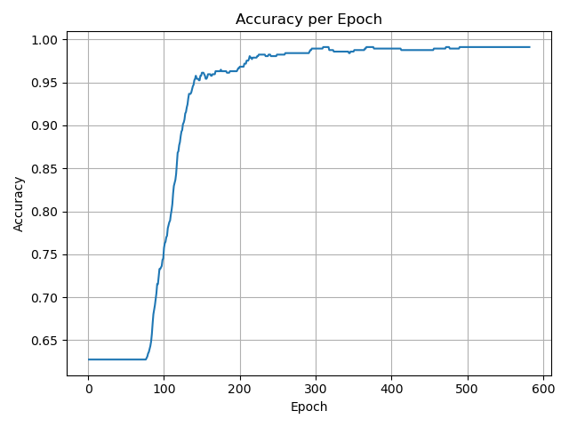

Neural Net from scratch with Python and Numpy

## Dataset:
Wisconsin Breast Cancer:  
https://archive.ics.uci.edu/ml/datasets/Breast+Cancer+Wisconsin+(Diagnostic)

## Purpose
Gain familiarity with the algorithm by developing it from scratch.
Hence, best ML practices such as train/test/cross-validation splits 
are NOT prioritized.

## Neural Net config
Fancy: for 30-dimensional input vector, 4 hidden layers with 16, 8, 4, 2 nodes respectively

## Absolute Error per Epoch

## Accuracy per Epoch

## Accuracy Stats

Overall Accuracy: 0.993

| Class         | Labeled       | Predicted|
|:-------------:|:-------------:|:-------------:|
| Malignant     | 212           | 208           |
| Benign        | 357           | 361           |

| Class         | True Positive | False Positive|
|:-------------:|:-------------:|:-------------:|
| Malignant     | 208           | 0             |
| Benign        | 357           | 4            |

| Class         | Precision     | Recall| F1 Score |
|:-------------:|:-------------:|:-----:|:--------:|
| Malignant     | 1.0        | 0.981 | 0.99    |
| Benign        | 0.989         | 1.0 | 0.994    |

Number of misclassified records: 4/569

|Record ID|Label| Predicted Malignant Probability| Absolute Error| LogIt Error | Rounded Prediction Error |
|:-------:|:---:|:--------------------:|:-------------:|:-----------:|:----------------:|
|842302|Malignant|1.0|0.0|0.0|0.0|
|842517|Malignant|1.0|0.0|0.0|0.0|
|84300903|Malignant|1.0|0.0|0.0|0.0|
|84348301|Malignant|1.0|0.0|0.0|0.0|
|84358402|Malignant|1.0|0.0|0.0|0.0|
|843786|Malignant|1.0|0.0|0.0|0.0|
|844359|Malignant|1.0|0.0|0.0|0.0|
|84458202|Malignant|1.0|0.0|0.0|0.0|
|844981|Malignant|1.0|0.0|0.0|0.0|
|84501001|Malignant|1.0|0.0|0.0|0.0|
|845636|Malignant|1.0|0.0|0.0|0.0|
|84610002|Malignant|1.0|0.0|0.0|0.0|
|846226|Malignant|1.0|0.0|0.0|0.0|
|846381|Malignant|1.0|0.0|0.0|0.0|
|84667401|Malignant|1.0|0.0|0.0|0.0|
|84799002|Malignant|1.0|0.0|0.0|0.0|
|848406|Malignant|1.0|0.0|0.0|0.0|
|84862001|Malignant|1.0|0.0|0.0|0.0|
|849014|Malignant|1.0|0.0|0.0|0.0|
|8510426|Benign|0.081|0.081|-0.0845|0.0|
|8510653|Benign|0.0001|0.0001|-0.0001|0.0|
|8510824|Benign|0.0|0.0|-0.0|0.0|
|8511133|Malignant|1.0|0.0|0.0|0.0|
|851509|Malignant|1.0|0.0|0.0|0.0|
|852552|Malignant|1.0|0.0|0.0|0.0|
|852631|Malignant|1.0|0.0|0.0|0.0|
|852763|Malignant|1.0|0.0|0.0|0.0|
|852781|Malignant|1.0|0.0|0.0|0.0|
|852973|Malignant|1.0|0.0|0.0|0.0|
|853201|Malignant|1.0|0.0|0.0|0.0|
|853401|Malignant|1.0|0.0|0.0|0.0|
|853612|Malignant|1.0|0.0|0.0|0.0|
|85382601|Malignant|1.0|0.0|0.0|0.0|
|854002|Malignant|1.0|0.0|0.0|0.0|
|854039|Malignant|1.0|0.0|0.0|0.0|
|854253|Malignant|1.0|0.0|0.0|0.0|
|854268|Malignant|1.0|0.0|0.0|0.0|
|854941|Benign|0.0228|0.0228|-0.023|0.0|
|855133|Malignant|1.0|0.0|0.0|0.0|
|855138|Malignant|1.0|0.0|0.0|0.0|
|855167|Malignant|0.1017|0.8983|2.2858|1.0|
|855563|Malignant|1.0|0.0|0.0|0.0|
|855625|Malignant|1.0|0.0|0.0|0.0|
|856106|Malignant|1.0|0.0|0.0|0.0|
|85638502|Malignant|1.0|0.0|0.0|0.0|
|857010|Malignant|1.0|0.0|0.0|0.0|
|85713702|Benign|0.0|0.0|-0.0|0.0|
|85715|Malignant|1.0|0.0|0.0|0.0|
|857155|Benign|0.044|0.044|-0.045|0.0|
|857156|Benign|0.1016|0.1016|-0.1071|0.0|
|857343|Benign|0.0192|0.0192|-0.0194|0.0|
|857373|Benign|0.0135|0.0135|-0.0136|0.0|
|857374|Benign|0.0063|0.0063|-0.0063|0.0|
|857392|Malignant|1.0|0.0|0.0|0.0|
|857438|Malignant|1.0|0.0|0.0|0.0|
|85759902|Benign|0.001|0.001|-0.001|0.0|
|857637|Malignant|1.0|0.0|0.0|0.0|
|857793|Malignant|1.0|0.0|0.0|0.0|
|857810|Benign|0.024|0.024|-0.0243|0.0|
|858477|Benign|0.0|0.0|-0.0|0.0|
|858970|Benign|0.0|0.0|-0.0|0.0|
|858981|Benign|0.0|0.0|-0.0|0.0|
|858986|Malignant|1.0|0.0|0.0|0.0|
|859196|Benign|0.0|0.0|-0.0|0.0|
|85922302|Malignant|1.0|0.0|0.0|0.0|
|859283|Malignant|1.0|0.0|0.0|0.0|
|859464|Benign|0.0006|0.0006|-0.0006|0.0|
|859465|Benign|0.0229|0.0229|-0.0231|0.0|
|859471|Benign|0.0007|0.0007|-0.0007|0.0|
|859487|Benign|0.0166|0.0166|-0.0167|0.0|
|859575|Malignant|1.0|0.0|0.0|0.0|
|859711|Benign|0.0|0.0|-0.0|0.0|
|859717|Malignant|1.0|0.0|0.0|0.0|
|859983|Malignant|0.0232|0.9768|3.7619|1.0|
|8610175|Benign|0.0239|0.0239|-0.0242|0.0|
|8610404|Malignant|1.0|0.0|0.0|0.0|
|8610629|Benign|0.0|0.0|-0.0|0.0|
|8610637|Malignant|1.0|0.0|0.0|0.0|
|8610862|Malignant|1.0|0.0|0.0|0.0|
|8610908|Benign|0.0044|0.0044|-0.0044|0.0|
|861103|Benign|0.0426|0.0426|-0.0436|0.0|
|8611161|Benign|0.0113|0.0113|-0.0113|0.0|
|8611555|Malignant|1.0|0.0|0.0|0.0|
|8611792|Malignant|1.0|0.0|0.0|0.0|
|8612080|Benign|0.0006|0.0006|-0.0006|0.0|
|8612399|Malignant|1.0|0.0|0.0|0.0|
|86135501|Malignant|1.0|0.0|0.0|0.0|
|86135502|Malignant|1.0|0.0|0.0|0.0|
|861597|Benign|0.0002|0.0002|-0.0002|0.0|
|861598|Benign|0.0006|0.0006|-0.0006|0.0|
|861648|Benign|0.0913|0.0913|-0.0958|0.0|
|861799|Malignant|1.0|0.0|0.0|0.0|
|861853|Benign|0.1008|0.1008|-0.1062|0.0|
|862009|Benign|0.0961|0.0961|-0.1011|0.0|
|862028|Malignant|1.0|0.0|0.0|0.0|
|86208|Malignant|1.0|0.0|0.0|0.0|
|86211|Benign|0.0002|0.0002|-0.0002|0.0|
|862261|Benign|0.0018|0.0018|-0.0018|0.0|
|862485|Benign|0.0092|0.0092|-0.0093|0.0|
|862548|Malignant|1.0|0.0|0.0|0.0|
|862717|Malignant|1.0|0.0|0.0|0.0|
|862722|Benign|0.0|0.0|-0.0|0.0|
|862965|Benign|0.101|0.101|-0.1065|0.0|
|862980|Benign|0.0|0.0|-0.0|0.0|
|862989|Benign|0.0|0.0|-0.0|0.0|
|863030|Malignant|1.0|0.0|0.0|0.0|
|863031|Benign|0.009|0.009|-0.009|0.0|
|863270|Benign|0.0747|0.0747|-0.0777|0.0|
|86355|Malignant|1.0|0.0|0.0|0.0|
|864018|Benign|0.0897|0.0897|-0.0939|0.0|
|864033|Benign|0.0|0.0|-0.0|0.0|
|86408|Benign|0.0004|0.0004|-0.0004|0.0|
|86409|Benign|0.0|0.0|-0.0|0.0|
|864292|Benign|0.0|0.0|-0.0|0.0|
|864496|Benign|0.0|0.0|-0.0|0.0|
|864685|Benign|0.0087|0.0087|-0.0087|0.0|
|864726|Benign|0.0|0.0|-0.0|0.0|
|864729|Malignant|1.0|0.0|0.0|0.0|
|864877|Malignant|1.0|0.0|0.0|0.0|
|865128|Malignant|1.0|0.0|0.0|0.0|
|865137|Benign|0.0172|0.0172|-0.0173|0.0|
|86517|Malignant|1.0|0.0|0.0|0.0|
|865423|Malignant|1.0|0.0|0.0|0.0|
|865432|Benign|0.0066|0.0066|-0.0067|0.0|
|865468|Benign|0.0001|0.0001|-0.0001|0.0|
|86561|Benign|0.0487|0.0487|-0.0499|0.0|
|866083|Malignant|1.0|0.0|0.0|0.0|
|866203|Malignant|1.0|0.0|0.0|0.0|
|866458|Benign|0.0025|0.0025|-0.0025|0.0|
|866674|Malignant|1.0|0.0|0.0|0.0|
|866714|Benign|0.0|0.0|-0.0|0.0|
|8670|Malignant|1.0|0.0|0.0|0.0|
|86730502|Malignant|1.0|0.0|0.0|0.0|
|867387|Benign|0.0978|0.0978|-0.1029|0.0|
|867739|Malignant|1.0|0.0|0.0|0.0|
|868202|Malignant|0.1018|0.8982|2.2847|1.0|
|868223|Benign|0.0588|0.0588|-0.0606|0.0|
|868682|Benign|0.0093|0.0093|-0.0093|0.0|
|868826|Malignant|1.0|0.0|0.0|0.0|
|868871|Benign|0.0|0.0|-0.0|0.0|
|868999|Benign|0.0|0.0|-0.0|0.0|
|869104|Malignant|1.0|0.0|0.0|0.0|
|869218|Benign|0.0005|0.0005|-0.0005|0.0|
|869224|Benign|0.0016|0.0016|-0.0016|0.0|
|869254|Benign|0.0031|0.0031|-0.0031|0.0|
|869476|Benign|0.0|0.0|-0.0|0.0|
|869691|Malignant|1.0|0.0|0.0|0.0|
|86973701|Benign|0.0|0.0|-0.0|0.0|
|86973702|Benign|0.0115|0.0115|-0.0116|0.0|
|869931|Benign|0.0086|0.0086|-0.0087|0.0|
|871001501|Benign|0.0963|0.0963|-0.1012|0.0|
|871001502|Benign|0.0004|0.0004|-0.0004|0.0|
|8710441|Benign|0.0003|0.0003|-0.0003|0.0|
|87106|Benign|0.0022|0.0022|-0.0022|0.0|
|8711002|Benign|0.0|0.0|-0.0|0.0|
|8711003|Benign|0.0049|0.0049|-0.0049|0.0|
|8711202|Malignant|1.0|0.0|0.0|0.0|
|8711216|Benign|0.101|0.101|-0.1065|0.0|
|871122|Benign|0.02|0.02|-0.0202|0.0|
|871149|Benign|0.0129|0.0129|-0.0129|0.0|
|8711561|Benign|0.0003|0.0003|-0.0003|0.0|
|8711803|Malignant|1.0|0.0|0.0|0.0|
|871201|Malignant|1.0|0.0|0.0|0.0|
|8712064|Benign|0.0|0.0|-0.0|0.0|
|8712289|Malignant|1.0|0.0|0.0|0.0|
|8712291|Benign|0.0964|0.0964|-0.1014|0.0|
|87127|Benign|0.0129|0.0129|-0.013|0.0|
|8712729|Malignant|1.0|0.0|0.0|0.0|
|8712766|Malignant|1.0|0.0|0.0|0.0|
|8712853|Benign|0.1001|0.1001|-0.1055|0.0|
|87139402|Benign|0.0021|0.0021|-0.0021|0.0|
|87163|Malignant|1.0|0.0|0.0|0.0|
|87164|Malignant|1.0|0.0|0.0|0.0|
|871641|Benign|0.0|0.0|-0.0|0.0|
|871642|Benign|0.0052|0.0052|-0.0052|0.0|
|872113|Benign|0.0|0.0|-0.0|0.0|
|872608|Benign|0.0003|0.0003|-0.0003|0.0|
|87281702|Malignant|1.0|0.0|0.0|0.0|
|873357|Benign|0.093|0.093|-0.0976|0.0|
|873586|Benign|0.0159|0.0159|-0.016|0.0|
|873592|Malignant|1.0|0.0|0.0|0.0|
|873593|Malignant|1.0|0.0|0.0|0.0|
|873701|Malignant|1.0|0.0|0.0|0.0|
|873843|Benign|0.0001|0.0001|-0.0001|0.0|
|873885|Malignant|1.0|0.0|0.0|0.0|
|874158|Benign|0.0065|0.0065|-0.0065|0.0|
|874217|Malignant|1.0|0.0|0.0|0.0|
|874373|Benign|0.0291|0.0291|-0.0296|0.0|
|874662|Benign|0.0045|0.0045|-0.0045|0.0|
|874839|Benign|0.0012|0.0012|-0.0012|0.0|
|874858|Malignant|1.0|0.0|0.0|0.0|
|875093|Benign|0.0|0.0|-0.0|0.0|
|875099|Benign|0.0001|0.0001|-0.0001|0.0|
|875263|Malignant|1.0|0.0|0.0|0.0|
|87556202|Malignant|1.0|0.0|0.0|0.0|
|875878|Benign|0.0038|0.0038|-0.0038|0.0|
|875938|Malignant|1.0|0.0|0.0|0.0|
|877159|Malignant|1.0|0.0|0.0|0.0|
|877486|Malignant|1.0|0.0|0.0|0.0|
|877500|Malignant|1.0|0.0|0.0|0.0|
|877501|Benign|0.0872|0.0872|-0.0912|0.0|
|877989|Malignant|1.0|0.0|0.0|0.0|
|878796|Malignant|1.0|0.0|0.0|0.0|
|87880|Malignant|1.0|0.0|0.0|0.0|
|87930|Benign|0.0021|0.0021|-0.0021|0.0|
|879523|Malignant|1.0|0.0|0.0|0.0|
|879804|Benign|0.0002|0.0002|-0.0002|0.0|
|879830|Malignant|1.0|0.0|0.0|0.0|
|8810158|Benign|0.0071|0.0071|-0.0071|0.0|
|8810436|Benign|0.0971|0.0971|-0.1021|0.0|
|881046502|Malignant|1.0|0.0|0.0|0.0|
|8810528|Benign|0.0024|0.0024|-0.0024|0.0|
|8810703|Malignant|1.0|0.0|0.0|0.0|
|881094802|Malignant|1.0|0.0|0.0|0.0|
|8810955|Malignant|1.0|0.0|0.0|0.0|
|8810987|Malignant|1.0|0.0|0.0|0.0|
|8811523|Benign|0.0003|0.0003|-0.0003|0.0|
|8811779|Benign|0.0|0.0|-0.0|0.0|
|8811842|Malignant|1.0|0.0|0.0|0.0|
|88119002|Malignant|1.0|0.0|0.0|0.0|
|8812816|Benign|0.0044|0.0044|-0.0044|0.0|
|8812818|Benign|0.0|0.0|-0.0|0.0|
|8812844|Benign|0.0|0.0|-0.0|0.0|
|8812877|Malignant|1.0|0.0|0.0|0.0|
|8813129|Benign|0.0804|0.0804|-0.0838|0.0|
|88143502|Benign|0.0955|0.0955|-0.1004|0.0|
|88147101|Benign|0.0258|0.0258|-0.0261|0.0|
|88147102|Benign|0.0001|0.0001|-0.0001|0.0|
|88147202|Benign|0.0115|0.0115|-0.0116|0.0|
|881861|Malignant|1.0|0.0|0.0|0.0|
|881972|Malignant|1.0|0.0|0.0|0.0|
|88199202|Benign|0.0008|0.0008|-0.0008|0.0|
|88203002|Benign|0.1008|0.1008|-0.1063|0.0|
|88206102|Malignant|1.0|0.0|0.0|0.0|
|882488|Benign|0.0057|0.0057|-0.0057|0.0|
|88249602|Benign|0.0908|0.0908|-0.0952|0.0|
|88299702|Malignant|1.0|0.0|0.0|0.0|
|883263|Malignant|1.0|0.0|0.0|0.0|
|883270|Benign|0.0961|0.0961|-0.101|0.0|
|88330202|Malignant|1.0|0.0|0.0|0.0|
|88350402|Benign|0.059|0.059|-0.0609|0.0|
|883539|Benign|0.0131|0.0131|-0.0132|0.0|
|883852|Benign|0.0001|0.0001|-0.0001|0.0|
|88411702|Benign|0.0008|0.0008|-0.0008|0.0|
|884180|Malignant|1.0|0.0|0.0|0.0|
|884437|Benign|0.0061|0.0061|-0.0061|0.0|
|884448|Benign|0.0063|0.0063|-0.0063|0.0|
|884626|Benign|0.0|0.0|-0.0|0.0|
|88466802|Benign|0.0802|0.0802|-0.0836|0.0|
|884689|Benign|0.0168|0.0168|-0.017|0.0|
|884948|Malignant|1.0|0.0|0.0|0.0|
|88518501|Benign|0.0117|0.0117|-0.0117|0.0|
|885429|Malignant|1.0|0.0|0.0|0.0|
|8860702|Malignant|1.0|0.0|0.0|0.0|
|886226|Malignant|1.0|0.0|0.0|0.0|
|886452|Malignant|1.0|0.0|0.0|0.0|
|88649001|Malignant|1.0|0.0|0.0|0.0|
|886776|Malignant|1.0|0.0|0.0|0.0|
|887181|Malignant|1.0|0.0|0.0|0.0|
|88725602|Malignant|1.0|0.0|0.0|0.0|
|887549|Malignant|1.0|0.0|0.0|0.0|
|888264|Malignant|1.0|0.0|0.0|0.0|
|888570|Malignant|1.0|0.0|0.0|0.0|
|889403|Malignant|0.5026|0.4974|0.6879|0.0|
|889719|Malignant|1.0|0.0|0.0|0.0|
|88995002|Malignant|1.0|0.0|0.0|0.0|
|8910251|Benign|0.0|0.0|-0.0|0.0|
|8910499|Benign|0.0005|0.0005|-0.0005|0.0|
|8910506|Benign|0.0|0.0|-0.0|0.0|
|8910720|Benign|0.0|0.0|-0.0|0.0|
|8910721|Benign|0.0122|0.0122|-0.0123|0.0|
|8910748|Benign|0.0006|0.0006|-0.0006|0.0|
|8910988|Malignant|1.0|0.0|0.0|0.0|
|8910996|Benign|0.0013|0.0013|-0.0013|0.0|
|8911163|Malignant|1.0|0.0|0.0|0.0|
|8911164|Benign|0.0587|0.0587|-0.0605|0.0|
|8911230|Benign|0.0076|0.0076|-0.0077|0.0|
|8911670|Malignant|1.0|0.0|0.0|0.0|
|8911800|Benign|0.1011|0.1011|-0.1066|0.0|
|8911834|Benign|0.0567|0.0567|-0.0584|0.0|
|8912049|Malignant|1.0|0.0|0.0|0.0|
|8912055|Benign|0.0015|0.0015|-0.0015|0.0|
|89122|Malignant|1.0|0.0|0.0|0.0|
|8912280|Malignant|1.0|0.0|0.0|0.0|
|8912284|Benign|0.0|0.0|-0.0|0.0|
|8912521|Benign|0.0093|0.0093|-0.0093|0.0|
|8912909|Benign|0.0|0.0|-0.0|0.0|
|8913|Benign|0.0068|0.0068|-0.0069|0.0|
|8913049|Benign|0.0003|0.0003|-0.0003|0.0|
|89143601|Benign|0.0|0.0|-0.0|0.0|
|89143602|Benign|0.0002|0.0002|-0.0002|0.0|
|8915|Benign|0.1178|0.1178|-0.1253|0.0|
|891670|Benign|0.0|0.0|-0.0|0.0|
|891703|Benign|0.0304|0.0304|-0.0309|0.0|
|891716|Benign|0.0106|0.0106|-0.0107|0.0|
|891923|Benign|0.0082|0.0082|-0.0083|0.0|
|891936|Benign|0.0001|0.0001|-0.0001|0.0|
|892189|Malignant|0.087|0.913|2.4418|1.0|
|892214|Benign|0.0834|0.0834|-0.0871|0.0|
|892399|Benign|0.0|0.0|-0.0|0.0|
|892438|Malignant|1.0|0.0|0.0|0.0|
|892604|Benign|0.0|0.0|-0.0|0.0|
|89263202|Malignant|1.0|0.0|0.0|0.0|
|892657|Benign|0.0136|0.0136|-0.0137|0.0|
|89296|Benign|0.0001|0.0001|-0.0001|0.0|
|893061|Benign|0.0|0.0|-0.0|0.0|
|89344|Benign|0.0341|0.0341|-0.0347|0.0|
|89346|Benign|0.0001|0.0001|-0.0001|0.0|
|893526|Benign|0.0088|0.0088|-0.0089|0.0|
|893548|Benign|0.0124|0.0124|-0.0125|0.0|
|893783|Benign|0.013|0.013|-0.0131|0.0|
|89382601|Benign|0.0999|0.0999|-0.1053|0.0|
|89382602|Benign|0.0001|0.0001|-0.0001|0.0|
|893988|Benign|0.0|0.0|-0.0|0.0|
|894047|Benign|0.0|0.0|-0.0|0.0|
|894089|Benign|0.0088|0.0088|-0.0088|0.0|
|894090|Benign|0.0081|0.0081|-0.0081|0.0|
|894326|Malignant|1.0|0.0|0.0|0.0|
|894329|Benign|0.0003|0.0003|-0.0003|0.0|
|894335|Benign|0.0153|0.0153|-0.0154|0.0|
|894604|Benign|0.0|0.0|-0.0|0.0|
|894618|Malignant|1.0|0.0|0.0|0.0|
|894855|Benign|0.0717|0.0717|-0.0744|0.0|
|895100|Malignant|1.0|0.0|0.0|0.0|
|89511501|Benign|0.048|0.048|-0.0492|0.0|
|89511502|Benign|0.0123|0.0123|-0.0124|0.0|
|89524|Benign|0.0183|0.0183|-0.0184|0.0|
|895299|Benign|0.0107|0.0107|-0.0108|0.0|
|8953902|Malignant|1.0|0.0|0.0|0.0|
|895633|Malignant|1.0|0.0|0.0|0.0|
|896839|Malignant|1.0|0.0|0.0|0.0|
|896864|Benign|0.0|0.0|-0.0|0.0|
|897132|Benign|0.0019|0.0019|-0.0019|0.0|
|897137|Benign|0.0395|0.0395|-0.0404|0.0|
|897374|Benign|0.0201|0.0201|-0.0203|0.0|
|89742801|Malignant|1.0|0.0|0.0|0.0|
|897604|Benign|0.0001|0.0001|-0.0001|0.0|
|897630|Malignant|1.0|0.0|0.0|0.0|
|897880|Benign|0.0041|0.0041|-0.0041|0.0|
|89812|Malignant|1.0|0.0|0.0|0.0|
|89813|Benign|0.0|0.0|-0.0|0.0|
|898143|Benign|0.0|0.0|-0.0|0.0|
|89827|Benign|0.0|0.0|-0.0|0.0|
|898431|Malignant|1.0|0.0|0.0|0.0|
|89864002|Benign|0.0061|0.0061|-0.0061|0.0|
|898677|Benign|0.0|0.0|-0.0|0.0|
|898678|Benign|0.0235|0.0235|-0.0238|0.0|
|89869|Benign|0.0879|0.0879|-0.092|0.0|
|898690|Benign|0.037|0.037|-0.0377|0.0|
|899147|Benign|0.0|0.0|-0.0|0.0|
|899187|Benign|0.0081|0.0081|-0.0081|0.0|
|899667|Malignant|1.0|0.0|0.0|0.0|
|899987|Malignant|1.0|0.0|0.0|0.0|
|9010018|Malignant|1.0|0.0|0.0|0.0|
|901011|Benign|0.0|0.0|-0.0|0.0|
|9010258|Benign|0.0|0.0|-0.0|0.0|
|9010259|Benign|0.0003|0.0003|-0.0003|0.0|
|901028|Benign|0.0421|0.0421|-0.043|0.0|
|9010333|Benign|0.0|0.0|-0.0|0.0|
|901034301|Benign|0.0852|0.0852|-0.0891|0.0|
|901034302|Benign|0.071|0.071|-0.0737|0.0|
|901041|Benign|0.023|0.023|-0.0233|0.0|
|9010598|Benign|0.0103|0.0103|-0.0104|0.0|
|9010872|Benign|0.1027|0.1027|-0.1084|0.0|
|9010877|Benign|0.0214|0.0214|-0.0216|0.0|
|901088|Malignant|1.0|0.0|0.0|0.0|
|9011494|Malignant|1.0|0.0|0.0|0.0|
|9011495|Benign|0.0437|0.0437|-0.0447|0.0|
|9011971|Malignant|1.0|0.0|0.0|0.0|
|9012000|Malignant|1.0|0.0|0.0|0.0|
|9012315|Malignant|1.0|0.0|0.0|0.0|
|9012568|Benign|0.0242|0.0242|-0.0245|0.0|
|9012795|Malignant|1.0|0.0|0.0|0.0|
|901288|Malignant|1.0|0.0|0.0|0.0|
|9013005|Benign|0.0018|0.0018|-0.0018|0.0|
|901303|Benign|0.0|0.0|-0.0|0.0|
|901315|Benign|0.0002|0.0002|-0.0002|0.0|
|9013579|Benign|0.0996|0.0996|-0.1049|0.0|
|9013594|Benign|0.0|0.0|-0.0|0.0|
|9013838|Malignant|1.0|0.0|0.0|0.0|
|901549|Benign|0.0005|0.0005|-0.0005|0.0|
|901836|Benign|0.0|0.0|-0.0|0.0|
|90250|Benign|0.0|0.0|-0.0|0.0|
|90251|Benign|0.0|0.0|-0.0|0.0|
|902727|Benign|0.0003|0.0003|-0.0003|0.0|
|90291|Malignant|1.0|0.0|0.0|0.0|
|902975|Benign|0.0|0.0|-0.0|0.0|
|902976|Benign|0.0075|0.0075|-0.0076|0.0|
|903011|Benign|0.0|0.0|-0.0|0.0|
|90312|Malignant|1.0|0.0|0.0|0.0|
|90317302|Benign|0.0|0.0|-0.0|0.0|
|903483|Benign|0.0|0.0|-0.0|0.0|
|903507|Malignant|1.0|0.0|0.0|0.0|
|903516|Malignant|1.0|0.0|0.0|0.0|
|903554|Benign|0.0399|0.0399|-0.0408|0.0|
|903811|Benign|0.0155|0.0155|-0.0156|0.0|
|90401601|Benign|0.0703|0.0703|-0.0729|0.0|
|90401602|Benign|0.0001|0.0001|-0.0001|0.0|
|904302|Benign|0.0012|0.0012|-0.0012|0.0|
|904357|Benign|0.0179|0.0179|-0.018|0.0|
|90439701|Malignant|1.0|0.0|0.0|0.0|
|904647|Benign|0.0704|0.0704|-0.073|0.0|
|904689|Benign|0.0|0.0|-0.0|0.0|
|9047|Benign|0.0031|0.0031|-0.0031|0.0|
|904969|Benign|0.0149|0.0149|-0.015|0.0|
|904971|Benign|0.0146|0.0146|-0.0147|0.0|
|905189|Benign|0.1012|0.1012|-0.1067|0.0|
|905190|Benign|0.0|0.0|-0.0|0.0|
|90524101|Malignant|1.0|0.0|0.0|0.0|
|905501|Benign|0.004|0.004|-0.004|0.0|
|905502|Benign|0.1007|0.1007|-0.1061|0.0|
|905520|Benign|0.0757|0.0757|-0.0787|0.0|
|905539|Benign|0.0|0.0|-0.0|0.0|
|905557|Benign|0.0288|0.0288|-0.0293|0.0|
|905680|Malignant|1.0|0.0|0.0|0.0|
|905686|Benign|0.0001|0.0001|-0.0001|0.0|
|905978|Benign|0.0001|0.0001|-0.0001|0.0|
|90602302|Malignant|1.0|0.0|0.0|0.0|
|906024|Benign|0.0016|0.0016|-0.0016|0.0|
|906290|Benign|0.0356|0.0356|-0.0363|0.0|
|906539|Benign|0.0|0.0|-0.0|0.0|
|906564|Benign|0.0004|0.0004|-0.0004|0.0|
|906616|Benign|0.0|0.0|-0.0|0.0|
|906878|Benign|0.0002|0.0002|-0.0002|0.0|
|907145|Benign|0.0|0.0|-0.0|0.0|
|907367|Benign|0.0789|0.0789|-0.0822|0.0|
|907409|Benign|0.0|0.0|-0.0|0.0|
|90745|Benign|0.0068|0.0068|-0.0068|0.0|
|90769601|Benign|0.0054|0.0054|-0.0054|0.0|
|90769602|Benign|0.0096|0.0096|-0.0096|0.0|
|907914|Malignant|1.0|0.0|0.0|0.0|
|907915|Benign|0.0|0.0|-0.0|0.0|
|908194|Malignant|1.0|0.0|0.0|0.0|
|908445|Malignant|1.0|0.0|0.0|0.0|
|908469|Benign|0.0776|0.0776|-0.0808|0.0|
|908489|Malignant|1.0|0.0|0.0|0.0|
|908916|Benign|0.016|0.016|-0.0161|0.0|
|909220|Benign|0.0922|0.0922|-0.0967|0.0|
|909231|Benign|0.0979|0.0979|-0.103|0.0|
|909410|Benign|0.0184|0.0184|-0.0186|0.0|
|909411|Benign|0.0|0.0|-0.0|0.0|
|909445|Malignant|1.0|0.0|0.0|0.0|
|90944601|Benign|0.0109|0.0109|-0.011|0.0|
|909777|Benign|0.0|0.0|-0.0|0.0|
|9110127|Malignant|1.0|0.0|0.0|0.0|
|9110720|Benign|0.0003|0.0003|-0.0003|0.0|
|9110732|Malignant|1.0|0.0|0.0|0.0|
|9110944|Benign|0.0967|0.0967|-0.1017|0.0|
|911150|Benign|0.0692|0.0692|-0.0717|0.0|
|911157302|Malignant|1.0|0.0|0.0|0.0|
|9111596|Benign|0.0|0.0|-0.0|0.0|
|9111805|Malignant|1.0|0.0|0.0|0.0|
|9111843|Benign|0.0001|0.0001|-0.0001|0.0|
|911201|Benign|0.011|0.011|-0.0111|0.0|
|911202|Benign|0.0767|0.0767|-0.0798|0.0|
|9112085|Benign|0.1063|0.1063|-0.1123|0.0|
|9112366|Benign|0.101|0.101|-0.1065|0.0|
|9112367|Benign|0.1014|0.1014|-0.1069|0.0|
|9112594|Benign|0.1006|0.1006|-0.106|0.0|
|9112712|Benign|0.0435|0.0435|-0.0445|0.0|
|911296201|Malignant|1.0|0.0|0.0|0.0|
|911296202|Malignant|1.0|0.0|0.0|0.0|
|9113156|Benign|0.0954|0.0954|-0.1002|0.0|
|911320501|Benign|0.0016|0.0016|-0.0016|0.0|
|911320502|Benign|0.043|0.043|-0.044|0.0|
|9113239|Benign|0.0003|0.0003|-0.0003|0.0|
|9113455|Benign|0.0002|0.0002|-0.0002|0.0|
|9113514|Benign|0.0007|0.0007|-0.0007|0.0|
|9113538|Malignant|1.0|0.0|0.0|0.0|
|911366|Benign|0.0016|0.0016|-0.0016|0.0|
|9113778|Benign|0.0|0.0|-0.0|0.0|
|9113816|Benign|0.0994|0.0994|-0.1046|0.0|
|911384|Benign|0.0463|0.0463|-0.0474|0.0|
|9113846|Benign|0.1003|0.1003|-0.1057|0.0|
|911391|Benign|0.0002|0.0002|-0.0002|0.0|
|911408|Benign|0.0003|0.0003|-0.0003|0.0|
|911654|Benign|0.0003|0.0003|-0.0003|0.0|
|911673|Benign|0.0101|0.0101|-0.0101|0.0|
|911685|Benign|0.0|0.0|-0.0|0.0|
|911916|Malignant|1.0|0.0|0.0|0.0|
|912193|Benign|0.0393|0.0393|-0.0401|0.0|
|91227|Benign|0.1015|0.1015|-0.107|0.0|
|912519|Benign|0.0013|0.0013|-0.0013|0.0|
|912558|Benign|0.0832|0.0832|-0.0869|0.0|
|912600|Benign|0.0419|0.0419|-0.0428|0.0|
|913063|Benign|0.0002|0.0002|-0.0002|0.0|
|913102|Benign|0.1009|0.1009|-0.1064|0.0|
|913505|Malignant|1.0|0.0|0.0|0.0|
|913512|Benign|0.018|0.018|-0.0182|0.0|
|913535|Malignant|1.0|0.0|0.0|0.0|
|91376701|Benign|0.0923|0.0923|-0.0968|0.0|
|91376702|Benign|0.0972|0.0972|-0.1022|0.0|
|914062|Malignant|1.0|0.0|0.0|0.0|
|914101|Benign|0.0028|0.0028|-0.0028|0.0|
|914102|Benign|0.008|0.008|-0.008|0.0|
|914333|Benign|0.0973|0.0973|-0.1024|0.0|
|914366|Benign|0.0002|0.0002|-0.0002|0.0|
|914580|Benign|0.0604|0.0604|-0.0623|0.0|
|914769|Malignant|1.0|0.0|0.0|0.0|
|91485|Malignant|1.0|0.0|0.0|0.0|
|914862|Benign|0.0272|0.0272|-0.0276|0.0|
|91504|Malignant|1.0|0.0|0.0|0.0|
|91505|Benign|0.0001|0.0001|-0.0001|0.0|
|915143|Malignant|1.0|0.0|0.0|0.0|
|915186|Benign|0.0005|0.0005|-0.0005|0.0|
|915276|Benign|0.0004|0.0004|-0.0004|0.0|
|91544001|Benign|0.0|0.0|-0.0|0.0|
|91544002|Benign|0.0|0.0|-0.0|0.0|
|915452|Benign|0.0993|0.0993|-0.1045|0.0|
|915460|Malignant|1.0|0.0|0.0|0.0|
|91550|Benign|0.0|0.0|-0.0|0.0|
|915664|Benign|0.0945|0.0945|-0.0992|0.0|
|915691|Malignant|1.0|0.0|0.0|0.0|
|915940|Benign|0.0872|0.0872|-0.0912|0.0|
|91594602|Malignant|1.0|0.0|0.0|0.0|
|916221|Benign|0.0015|0.0015|-0.0015|0.0|
|916799|Malignant|1.0|0.0|0.0|0.0|
|916838|Malignant|1.0|0.0|0.0|0.0|
|917062|Benign|0.0023|0.0023|-0.0023|0.0|
|917080|Benign|0.0015|0.0015|-0.0015|0.0|
|917092|Benign|0.0003|0.0003|-0.0003|0.0|
|91762702|Malignant|1.0|0.0|0.0|0.0|
|91789|Benign|0.0505|0.0505|-0.0518|0.0|
|917896|Benign|0.0039|0.0039|-0.0039|0.0|
|917897|Benign|0.0002|0.0002|-0.0002|0.0|
|91805|Benign|0.0001|0.0001|-0.0001|0.0|
|91813701|Benign|0.1014|0.1014|-0.1069|0.0|
|91813702|Benign|0.0778|0.0778|-0.081|0.0|
|918192|Benign|0.0015|0.0015|-0.0015|0.0|
|918465|Benign|0.0026|0.0026|-0.0026|0.0|
|91858|Benign|0.088|0.088|-0.0921|0.0|
|91903901|Benign|0.0038|0.0038|-0.0038|0.0|
|91903902|Benign|0.0831|0.0831|-0.0867|0.0|
|91930402|Malignant|1.0|0.0|0.0|0.0|
|919537|Benign|0.0|0.0|-0.0|0.0|
|919555|Malignant|1.0|0.0|0.0|0.0|
|91979701|Malignant|1.0|0.0|0.0|0.0|
|919812|Benign|0.0013|0.0013|-0.0013|0.0|
|921092|Benign|0.0|0.0|-0.0|0.0|
|921362|Benign|0.0004|0.0004|-0.0004|0.0|
|921385|Benign|0.0|0.0|-0.0|0.0|
|921386|Benign|0.0252|0.0252|-0.0255|0.0|
|921644|Benign|0.1014|0.1014|-0.1069|0.0|
|922296|Benign|0.1001|0.1001|-0.1055|0.0|
|922297|Benign|0.0007|0.0007|-0.0007|0.0|
|922576|Benign|0.0907|0.0907|-0.0951|0.0|
|922577|Benign|0.0254|0.0254|-0.0257|0.0|
|922840|Benign|0.0|0.0|-0.0|0.0|
|923169|Benign|0.0001|0.0001|-0.0001|0.0|
|923465|Benign|0.0088|0.0088|-0.0088|0.0|
|923748|Benign|0.0092|0.0092|-0.0092|0.0|
|923780|Benign|0.0|0.0|-0.0|0.0|
|924084|Benign|0.0987|0.0987|-0.1039|0.0|
|924342|Benign|0.0|0.0|-0.0|0.0|
|924632|Benign|0.0888|0.0888|-0.093|0.0|
|924934|Benign|0.0002|0.0002|-0.0002|0.0|
|924964|Benign|0.0009|0.0009|-0.0009|0.0|
|925236|Benign|0.016|0.016|-0.0161|0.0|
|925277|Benign|0.0001|0.0001|-0.0001|0.0|
|925291|Benign|0.0001|0.0001|-0.0001|0.0|
|925292|Benign|0.0004|0.0004|-0.0004|0.0|
|925311|Benign|0.0409|0.0409|-0.0418|0.0|
|925622|Malignant|1.0|0.0|0.0|0.0|
|926125|Malignant|1.0|0.0|0.0|0.0|
|926424|Malignant|1.0|0.0|0.0|0.0|
|926682|Malignant|1.0|0.0|0.0|0.0|
|926954|Malignant|1.0|0.0|0.0|0.0|
|927241|Malignant|1.0|0.0|0.0|0.0|
|92751|Benign|0.0002|0.0002|-0.0002|0.0|